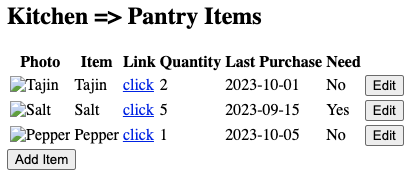

# <u>Personal Project</u>

## June 23, 2025
**Name: Home Tracker**

**Problem:**
When I go shopping or encounter a deal when I am not home, it's hard to remember how much of a product or item do I have. Sometimes I end up having too much of something or end up not having anything of something because I thought wrong. 

**Solution:**
I want to create an app tracker where I can track household items and quantities that I have of each. It will allowed me to organzie items in a way that resembles my home use and it will update quantities when needed. It will also hold a link to directly buy the product, data last purchased, and a message that will say whether or not I should buy the product. 

* For now, emojis will reflect photos of items and the need message:
:white_check_mark: = Product Needed, needs to be purchase
:no_entry_sign: = Product Not Needed, no need to purchase

**Example:**
I have a habit of making coffee, which consists on several items that I can keep track so that I don't miss a day of my coffee. 

In my tracker I would have a section for food, and inside food section I would have a coffee items section. It will have a list of items associated with making coffee and it will show for each item: product name with optional photo, direct link to buy, quantity amount, a message on whether to buy the product.

<u> **Coffee Items** </u>
| Photo | Item | Link | Quantity | Last Purchase| Need | 
| ----- | ---- | ---- | -------- | ------------ | ---- |
| :coffee: | Lavazza Coffee Beans | [Amazon](https://www.amazon.com/dp/B016RY0LWO?ref_=ppx_hzsearch_conn_dt_b_fed_asin_title_2&th=1) | 4 Bags | 04/23 | :no_entry_sign: |
| :cow2: | Milk | n/a | 1 gallon | 05/23 | :white_check_mark: |

Now, I can look up my coffee items and noticed that I should buy milk since I have a gallon that was opened in 05/23. 

## July 2, 2025
**How to Implement:**
The application will use web storage, specifically sessionStoage to store and retrieve items that are being kept track off.

For now, the website will act as a "playground" for users to add and remove items from different provided categories.

**Future Ideas**
- Option to add items to a "To Buy" list

## July 13, 2025 
- Started react app with express server
- Added 3 routes: HomeTrackerPage, NotesPage, NotFoundPage

## July 14, 2025
- Added another react app for express server
    - App1: Home Tracker (Current Project) => /app1
    - App2: Not Decided => /app2
- Added /projects routing to react apps
    - App1: /project/app1
    - App2: /project/app2
- Started working on home tracker layout

## July 15, 2025
- Completed basic layout of tracker table for a room
- Created Room component to create tables
- Example of basic table: 
    
    
## July 19, 2025
- Working on tracker table:
    - wrapped table in a form tag
    - currently passing sample data to Room component to make tracker table display sample data
    - bottom of table displays input cells to add items to tracker
    - form is submitted when save button is clicked
- Currently Looks: 
    
- Problems:
    - when save button clicked, empty row is rendered
    - when clicked a 2nd time, new row is added under empty one with form values inputted
    - when adding new values to submit form again, it just renders empty rows
    => issues with rendering properly