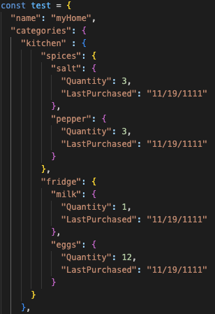
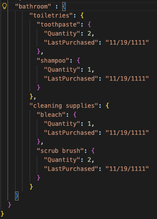
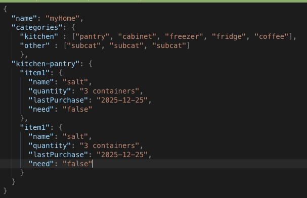
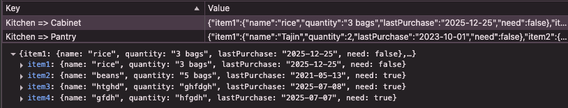
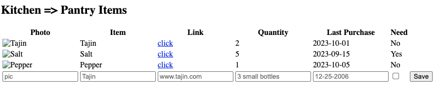
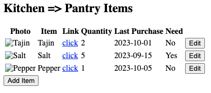

# Home Tracker Progress Journal
## January 24, 2026
- added list state to intial state for use reducer 
- add button adds item to list state variable and gets updated in local object
- changed home tracker to only track item name and quantity

## January 22, 2026
- able to save & display new item to hometracker
  - data state variable gets updated to show change when navigating 
- clear button logic in hometracker added 
- able to delete items from hometracker
  - updates change in local storage & in data state variable

## January 21, 2026
- added useReducer to manage data, view, category, subcategory
- deleted all useState relating to these 4 state variables
- helps manages the states & don't have to continously pass them into components

## Januarary 11, 2026
- submitting new item to home tracker updates in local storage 
- turned items into state variable inside home tracker
  - allows tracker to rerender and show newly added item

## December 18. 2025
- got rid of routes completely 
- changed to different views: category, subcategory, hometracker
- able to go to back and forth between components
- able to add new item to local storage 
    - still need to render new item on traker table 
- header needs to be redone to reflect views changes

## December 16, 2025
- added redirecting just in case user tries to route directly with route

  Ex: User types ".../home_tracker/kitchen" or ".../home_tracker/kitchen/spices"

  - message display will alert user to access categories and hometracker through home page
  - after message, user redirect to home page to see available categories to navigate from

## December 12, 2025

- changed JSON Hometracker Object

  - subcategories are nested within categories

 

- restructured home page

  - categories are shown at home page
  - when a category is clicked => subcategories are shown
  - when subcategory is clicked => subcategory items tracker table shown
- working on adding home tracker component from old Room component

| Route                           | Description                                        |
| ------------------------------- | -------------------------------------------------- |
| /                               | shows categories                                   |
| /:categoryName                  | shows subcategories                                |
| /:categoryName/:subcategoryName | shows hometracker details for items in subcategory |

## August 12, 2025

Home Page:

- changed local storage object to "hometracker"
- Example of JSON Hometracker Object
  
- render existing categories or empty circle to add category

  - empty circle needs more working to add category to object

## July 30, 2025

- working in Home component
- configuring view of what to render in home categories

<u>Details of Home component, what needs to be done:</u>

- using local storage object "MyHome" to contain list of categories :white_check_mark:

  - when it exists & has items => render circles with names on it :white_check_mark:
  - when it DNE or exists with no items => render message to guide user to add button
- when add btn clicked => circle is render with input, delete, save option
- when minus btn clicked => circles are render with delete option

  - maybe add edit btn & combine with delete
  - circles are render with delete option and editable input
  - same as when add btn is added basically but rendering existing data in input to edit

## July 29, 2025

- added local storage to Home page
- fixed category circles

## July 28, 2025

- finished Header component

  - navbar is responsive
  - added collapsable functionality for small screens
  - added corresponding links to navbar
- started Home page

  - added components
  - currently rendenring array of categories to test it

## July 27, 2025

- Wireframes draft completed
- Installed bootstrap
- Added Header component

  - Navbar: responsive navigation header
  - still need to fully customize it
  - includes app title & links to home, about app, buy list

## July 24, 2025

- working on wireframes in Figma

  - started on mobile version
  - home page, room page, sub-room page

=> [Wireframes Link](https://www.figma.com/design/8sW1TzInPpOAzrW5jv6Jfx/Untitled?node-id=2-226&t=FrnRZQfhIYSe8Ccg-0)

## July 23, 2025

- added local storage

  - can save data object for each room
  - can retrieve data object to render room component with it
- problems:

  - when editing row => need to add delete row functionality
  - need to render table when data is not null else empty table
  - work on wireframes!!
- Example of local storage:
  

## July 22, 2025

- got rid of link and photo option
- added input validation so item name and quantity are required when adding a new item

  - alert messsage displayed when missing either one or both
- rows are editable

  - edit button click for row and it turns into editable row
  - save & cancel button appear when editing row
  - includes input validation
- adding a row and editing row works now

## July 21, 2025

- got rid of form to use instead state variables to track input values
- use react refs to track input values instead of using onChange

  - onChange will cause unnecessary rendering
- table is rendering proper new item when clicked saved
- next:

  - work on edit functionally to edit row
  - need to validate input to prevent empty rows and required some information:

    - item name, quantity
  - get rid of link option

    - unsafe to add links (for now at least)
  - add option to add item to list
  - maybe change photo to emoji or just get rid of column for now

## July 19, 2025

- Working on tracker table:

  - wrapped table in a form tag
  - currently passing sample data to Room component to make tracker table display sample data
  - bottom of table displays input cells to add items to tracker
  - form is submitted when save button is clicked
- Currently Looks:
  
- Problems:

  - when save button clicked, empty row is rendered
  - when clicked a 2nd time, new row is added under empty one with form values inputted
  - when adding new values to submit form again, it just renders empty rows
    => issues with rendering properly

## July 15, 2025

- Completed basic layout of tracker table for a room
- Created Room component to create tables
- Example of basic table:
  

## July 14, 2025

- Added another react app for express server

  - App1: Home Tracker (Current Project) => /app1
  - App2: Not Decided => /app2
- Added /projects routing to react apps

  - App1: /project/app1
  - App2: /project/app2
- Started working on home tracker layout

## July 13, 2025

- Started react app with express server
- Added 3 routes: HomeTrackerPage, NotesPage, NotFoundPage

## July 2, 2025

**How to Implement:**

The application will use web storage, specifically sessionStoage to store and retrieve items that are being kept track off.

For now, the website will act as a "playground" for users to add and remove items from different provided categories.

**Future Ideas**

- Option to add items to a "To Buy" list
